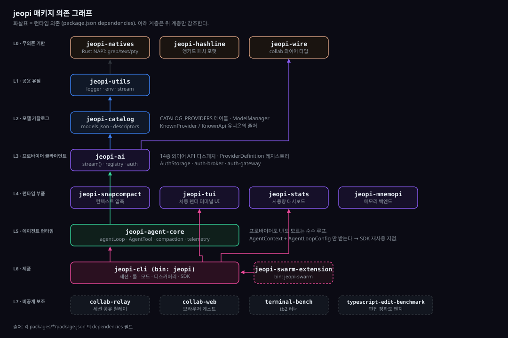
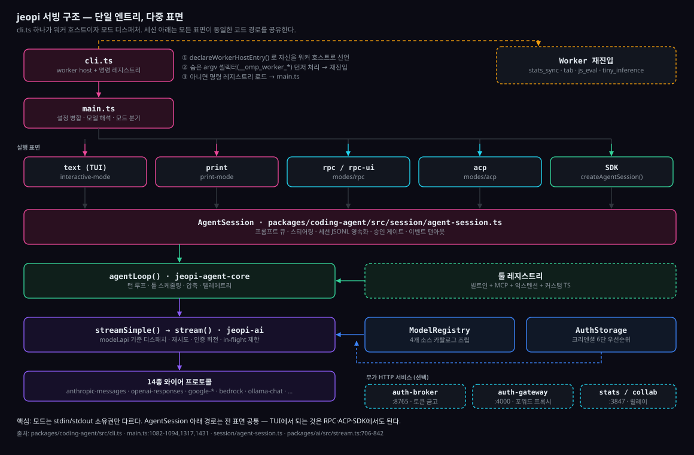
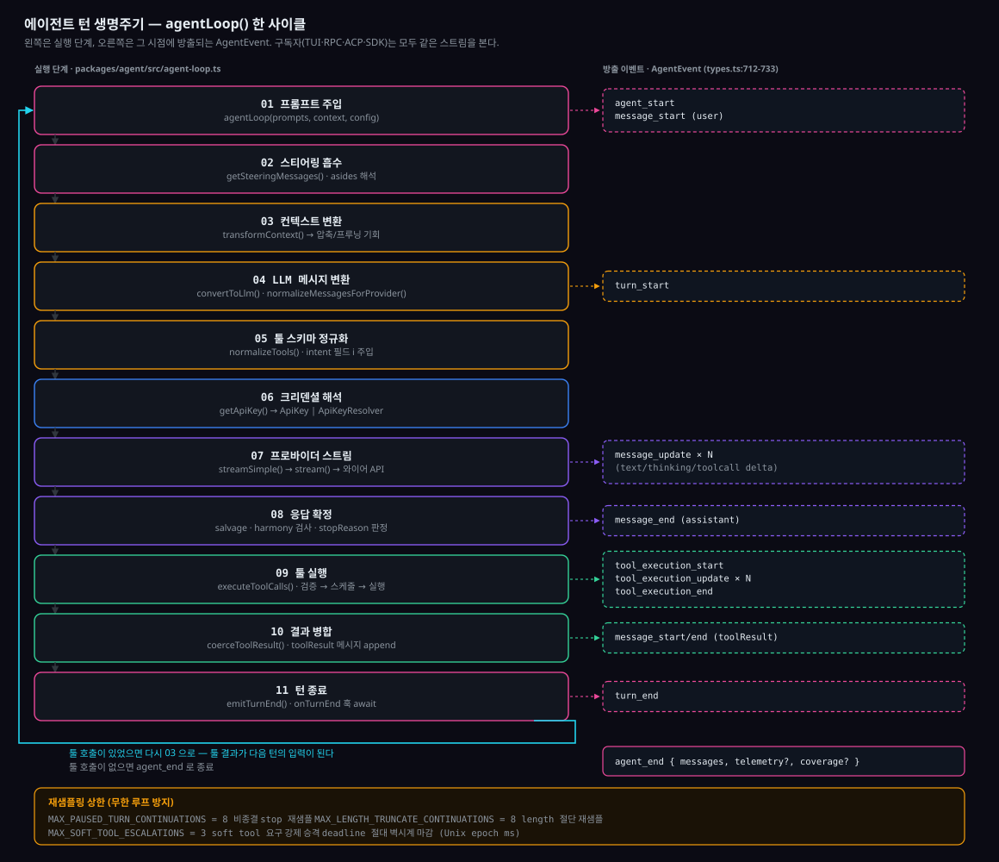
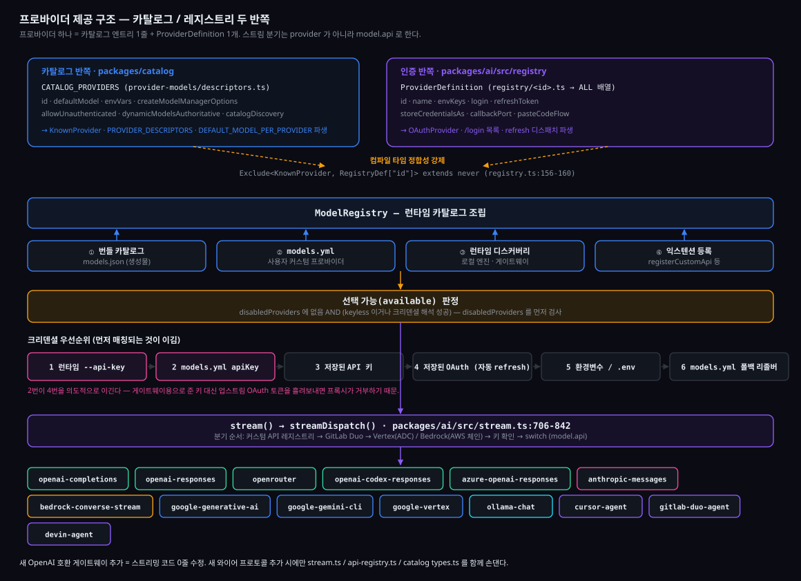
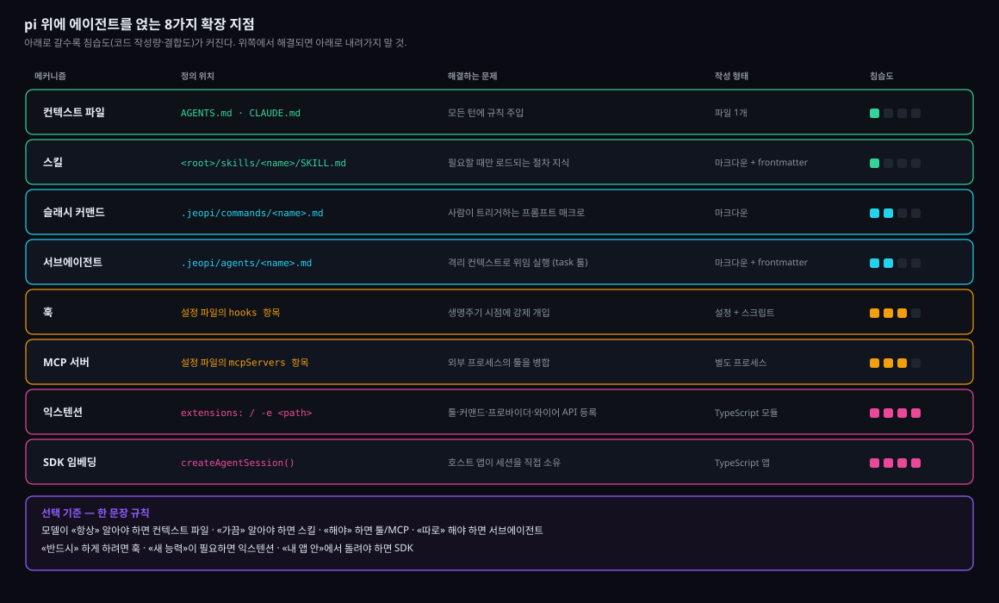

# jeopi 아키텍처

이 문서는 jeopi가 **어떤 구조로 서빙되고, 모델 요청이 어떤 흐름으로 흐르며, 그 위에 어떻게 자기 에이전트를 얹는지**를 한 곳에 모은 것이다.

읽는 순서는 두 가지다.

- **구조를 알고 싶다** → §1 패키지 지도 → §2 서빙 → §3 세션 → §4 에이전트 런타임 → §5 프로바이더
- **에이전트를 만들고 싶다** → §6 확장 지점 선택 → §7 레시피 → §8 함정

모든 주장에는 `파일:줄` 근거가 붙어 있다. 근거 없는 문장은 이 문서에 없다.

> **이름 표기 주의.** 바이너리 이름은 `jeopi`(`packages/coding-agent/package.json`의 `bin`)다. 기존 문서 다수가 `omp`라는 옛 이름을 쓰고 있고, 환경변수도 `JEOPI_*`가 현행이다(예: `JEOPI_AUTH_BROKER_URL` — `packages/coding-agent/src/session/auth-broker-config.ts:10`). 옛 문서에 보이는 `OMP_*` 표기는 드리프트다.

---

## 1. 패키지 지도



의존은 **단방향 7계층**이고 순환이 없다. 아래 표는 각 `packages/*/package.json`의 `dependencies`에서 그대로 뽑은 것이다.

| 계층 | 패키지 | 역할 | 내부 의존 |
|---|---|---|---|
| L0 | `jeopi-natives` | Rust NAPI 바인딩 — grep·텍스트·PTY | 없음 |
| L0 | `jeopi-hashline` | 앵커드 패치 포맷 | 없음 |
| L0 | `jeopi-wire` | collab 와이어 타입 | 없음 |
| L1 | `jeopi-utils` | logger · env · stream · dirs · frontmatter | natives |
| L2 | `jeopi-catalog` | `models.json` · 프로바이더 디스크립터 · ModelManager | utils |
| L3 | `jeopi-ai` | 프로바이더 클라이언트 · 스트림 디스패치 · 인증 | catalog, utils, wire |
| L4 | `jeopi-snapcompact` / `jeopi-tui` / `jeopi-stats` / `jeopi-mnemopi` | 압축 · 터미널 UI · 대시보드 · 메모리 | ai 계열 |
| L5 | `jeopi-agent-core` | **에이전트 루프** — 프로바이더도 UI도 모른다 | ai, catalog, natives, snapcompact, utils, wire |
| L6 | `jeopi-cli` (`bin: jeopi`) | 세션 · 툴 · 모드 · 디스커버리 · SDK | 위 전부 |
| L7 | `jeopi-swarm-extension` | `bin: jeopi-swarm` | cli, utils |

**핵심 경계는 L5다.** `jeopi-agent-core`는 `AgentContext`와 `AgentLoopConfig`만 받고, 프로바이더 호출은 교체 가능한 `StreamFn`으로 주입받는다(`packages/agent/src/types.ts:28-30`). 즉 CLI·TUI·세션·툴 레지스트리를 전부 버리고 루프만 재사용하는 것이 가능하다(→ §6.7).

비공개 보조 패키지: `collab-relay`(세션 공유 릴레이), `collab-web`(브라우저 게스트), `terminal-bench`(`tb2`), `typescript-edit-benchmark`.

---

## 2. 서빙 구조



jeopi는 상주 서버가 아니다. **엔트리 모듈 하나(`cli.ts`)가 모드에 따라 다른 표면으로 변신**한다.

### 2.1 배포 형태

| 경로 | 산출물 | 근거 |
|---|---|---|
| npm | `jeopi-cli` → `bin: dist/cli.js` | `packages/coding-agent/package.json` |
| 네이티브 바이너리 | 5개 타깃 (아래 표) | `scripts/ci-release-build-binaries.ts:30-66` |
| 컨테이너 | `Dockerfile` 4스테이지 + `Dockerfile.robomp` | `Dockerfile:3-23` |
| 설치 스크립트 | 바이너리 다운로드 또는 `bun install -g` | `scripts/install.sh:170-232` |

컴파일 타깃 5종(`scripts/ci-release-build-binaries.ts:35-65`):

| id | `--target` | 산출 파일 |
|---|---|---|
| `darwin-arm64` | `bun-darwin-arm64` | `binaries/jeopi-darwin-arm64` |
| `darwin-x64` | `bun-darwin-x64` | `binaries/jeopi-darwin-x64` |
| `linux-x64` | `bun-linux-x64-baseline` | `binaries/jeopi-linux-x64` |
| `linux-arm64` | `bun-linux-arm64` | `binaries/jeopi-linux-arm64` |
| `win32-x64` | `bun-windows-x64-baseline` | `binaries/jeopi-windows-x64.exe` |

x64가 `-baseline`인 이유는 Rosetta·pre-AVX2 CPU에서도 돌아야 하기 때문이다(`packages/coding-agent/scripts/build-binary.ts:12`).

`prepack`이 `gen:docs → gen:tool-views → gen:bundle`을 돌리고 `postpack`이 되돌리는 이유: tarball은 `src/`를 싣는데, 저장소에 체크인된 `docs-index.generated.txt`·stats 아카이브·tool-views는 **의도적으로 비어 있는 플레이스홀더**라서 pack 시점에만 생성 내용이 존재해야 한다(`scripts/ci-release-publish.ts:16-25`).

### 2.2 부팅 순서

```
① cli.ts  ─ 프로필 해석 (--profile/--alias)          cli.ts:227-259
          ─ declareWorkerHostEntry()                  cli.ts:285
          ─ __omp_worker_* 셀렉터 분기 (await 이전!)   cli.ts:271-274
          ─ --smoke-test 분기                          cli.ts:287
          └ 명령 레지스트리 → main.ts
② main.ts ─ 설정 병합 (global→project→--config→런타임) settings.ts:1314-1317
          ─ 모델 해석 (3패스)                          sdk.ts:1265 / 1926 / 1974
          ─ 모드 분기                                  main.ts:1093-1094
          └ createAgentSession() → 프롬프트 루프
```

**임포트 순서가 load-bearing이다.** `jeopi-utils/env`는 임포트 시점에 `.env`를 즉시 읽는다(`packages/utils/src/env.ts:101-105`). 그래서 `cli.ts`는 프로필을 먼저 해석한 뒤에야 `env`를 끌어오는 무언가를 임포트할 수 있고, `worker-host`는 이 때문에 부작용이 없도록 설계되어 있다(`packages/coding-agent/src/cli.ts:33-36`).

### 2.3 실행 모드

`Mode = "text" | "json" | "rpc" | "acp" | "rpc-ui"` (`packages/coding-agent/src/cli/args.ts:19`).

| 모드 | 선택 조건 | 구현 | stdin | stdout | `hasUI` |
|---|---|---|---|---|---|
| `text` (대화형) | 기본값 — `--print` 없음, `--mode` 없음, 파이프 입력 없음 | `InteractiveMode` (`modes/interactive-mode.ts:379`) | TUI raw mode | TUI | `true` |
| `print` | `-p`/`--print`, 또는 파이프 입력 자동 감지 | `runPrintMode` (`modes/print-mode.ts:35`) | EOF까지 읽어 프롬프트로 | 최종 응답만 | `false` |
| `json` | `--mode json` | 같은 `runPrintMode` | 동일 | 줄당 JSON 이벤트 1개 | `false` |
| `rpc` | `--mode rpc` | `runRpcMode` (`modes/rpc/rpc-mode.ts:599`) | JSONL 독점 | JSON 채널 독점 | `false` |
| `rpc-ui` | `--mode rpc-ui` | 동일 + `setToolUIContext` | 동일 | 동일 | `true` |
| `acp` | `--mode acp` 또는 `acp` 서브명령 | `runAcpMode` (`modes/acp/acp-mode.ts:16`) | ACP ndJsonStream | JSON-RPC | `false` |

프로토콜 모드(`rpc`/`rpc-ui`/`acp`)는 stdin을 독점하므로 파이프 입력을 프롬프트로 읽지 않는다(`main.ts:1094-1096`). 또한 워크플로를 바꾸는 설정을 기본값으로 되돌린다 — 단, `isConfigured()` 가드가 있어서 호출자·프로젝트·`--config`·전역에서 **명시적으로 설정한 값은 보존**된다(`main.ts:183-188`).

> 여기가 이 설계의 핵심이다. 모드는 **stdin/stdout 소유권만** 다르다. `AgentSession` 아래 경로는 전 표면 공통이므로, TUI에서 되는 것은 RPC·ACP·SDK에서도 된다.

### 2.4 워커 서브시스템

워커는 **별도 엔트리 모듈을 만들지 않는다.** `cli.ts`가 자신을 워커 호스트로 선언하고, 숨은 argv 셀렉터로 자기 자신에 재진입한다.

| 셀렉터 | 워커 모듈 | 전송 | 용도 |
|---|---|---|---|
| `__omp_worker_tiny_inference` | `./tiny/worker` | IPC 서브프로세스 | 로컬 tiny 모델 세션 제목 |
| `__omp_worker_stats_sync` | `jeopi-stats/sync-worker` | Worker 스레드 | 세션 파일 파싱 팬아웃 |
| `__omp_worker_tab` | `./tools/browser/tab-worker-entry` | Worker 스레드 | Puppeteer 탭 |
| `__omp_worker_js_eval` | `./eval/js/worker-entry` | Worker 스레드 | JS eval 셀 |
| `__omp_worker_stt` | `./stt/asr-worker` | IPC 서브프로세스 | 음성 인식 |
| `__omp_worker_tts` | `./tts/tts-worker` | IPC 서브프로세스 | 음성 합성 |
| `__omp_worker_mnemopi_embed` | `./mnemopi/embed-worker` | IPC 서브프로세스 | 로컬 임베딩 |

셀렉터 상수는 `packages/coding-agent/src/cli.ts:88-94`, 디스패치 분기는 `:96-154`.

**두 가지 제약이 이 설계를 지탱한다.**

1. **셀렉터 분기는 부트스트랩 이후 첫 `await`보다 먼저 와야 한다.** Bun은 엔트리 모듈의 최상위 평가가 끝나는 시점에 스폰 이전 부모 메시지를 flush한다. 뒤로 밀면 부모의 동기 `init`을 놓치고, 매 실행이 init 타임아웃까지 멈췄다가 조용히 인라인 폴백으로 떨어진다(`cli.ts:266-274`, `packages/utils/src/worker-host.ts:24-44`).
2. **IPC 워커는 부모가 끊기면 스스로 `SIGKILL`한다.** `onnxruntime-node`의 NAPI 파이널라이저가 절대 돌면 안 되기 때문이다(`cli.ts:168-215`).

검증은 `jeopi --smoke-test`가 담당한다(`cli.ts:59-86`). 워커별 타임아웃 30초(`SMOKE_TEST_TIMEOUT_MS`, `subprocess/worker-client.ts:89`), CI 배선은 `scripts/install-tests/run-ci.sh:27`. 새 워커를 추가하면 셀렉터를 디스패치 표에 넣고 스모크 프로브도 같이 늘려야 한다. 다만 현재 프로브는 `__omp_worker_tab`을 **커버하지 않고**, `smokeTestSyncWorker()`는 darwin에서 **조기 반환**한다.

과거 이력: `with { type: "file" }`은 엔트리를 원시 에셋으로만 복사해서 컴파일 바이너리에서 워커가 조용히 죽었고(#1011, #1027), 이후의 리터럴 경로 + 별도 엔트리포인트 방식은 스폰 리터럴과 빌드 스크립트 2개를 동기화해야 했다(#1150).

### 2.5 부가 HTTP 서비스

CLI에서 포트를 여는 것은 이 넷뿐이다.

| 명령 | 기본 바인드 | 역할 | 구현 |
|---|---|---|---|
| `jeopi auth-broker serve` | `127.0.0.1:8765` | OAuth refresh token 금고 (SQLite 단일 writer) | `packages/ai/src/auth-broker/server.ts:501` |
| `jeopi auth-gateway serve` | `127.0.0.1:4000` | 포워드 프록시 — OpenAI/Anthropic/pi-native 와이어 수용 | `packages/ai/src/auth-gateway/server.ts:736` |
| `jeopi stats` | `:3847` | 사용량 대시보드 | `packages/stats/src/server.ts:293` |
| collab relay | `0.0.0.0:8787` | 세션 공유 (jeopi 서브명령 아님) | `packages/collab-relay/src/server.ts:32` |

게이트웨이에 **원시 패스스루 경로는 없다.** 모든 라우트가 `pi-ai` 프로바이더 로직을 통과해야 크리덴셜 성형·OAuth 재시도·프로바이더 특수처리가 한 곳에 남는다(`docs/auth-broker-gateway.md:119`).

브로커는 기본 **꺼져 있고**, `JEOPI_AUTH_BROKER_URL`(또는 `auth.broker.url`)이 설정될 때만 로컬 SQLite 대신 `RemoteAuthCredentialStore`로 갈아탄다(`packages/coding-agent/src/session/auth-broker-config.ts:9-13`).

### 2.6 디렉터리 레이아웃

`CONFIG_DIR_NAME = ".jeopi"` (`packages/utils/src/dirs.ts:23`).

| 경로 | 내용 |
|---|---|
| `~/.jeopi/` | `logs/` `plugins/` `wt/`(워크트리) `cache/` `stats.db` `plugin-trust.json` |
| `~/.jeopi/agent/` | `agent.db`(인증) `models.db`(모델 캐시) `sessions/` `blobs/` `config.yml` `models.yml` `mcp.json` `agents/` `commands/` `prompts/` `memories/` |
| `<project>/.jeopi/` | `config.yml` `mcp.json` `agents/` `commands/` `modules/` `prompts/` |

`PI_CONFIG_DIR`은 설정 루트 **이름**을, `PI_CODING_AGENT_DIR`은 에이전트 디렉터리를 바꾼다(`dirs.ts:206-208`, `:239-245`). 프로필은 `<root>/profiles/<name>/`로 격리된다(`dirs.ts:107-124`).

---

## 3. 세션 계층

`AgentSession`(`packages/coding-agent/src/session/agent-session.ts`)은 순수 루프 위에 **세션 의미론**을 접붙인다: 프롬프트 큐, 스티어링, 영속화, 승인 게이트, 압축 스케줄링, 이벤트 팬아웃.

### 3.1 `createAgentSession()` — "주면 덮어쓰고, 안 주면 발견한다"

```ts
const { session, modelFallbackMessage } = await createAgentSession();
```

옵션은 54개지만 **필수는 0개**다. 생략 시 해석되는 주요 기본값(`packages/coding-agent/src/sdk.ts:377-565` 선언, 아래는 *해석 지점*):

| 필드 | 생략 시 | 해석 위치 |
|---|---|---|
| `cwd` | `getProjectDir()` | `sdk.ts:1098` |
| `agentDir` | `getAgentDir()` (`~/.jeopi/agent`) | `sdk.ts:1099` |
| `authStorage` | `await discoverAuthStorage(agentDir)` | `sdk.ts:1110` |
| `modelRegistry` | `new ModelRegistry(authStorage)` + 백그라운드 새로고침 | `sdk.ts:1108-1140` |
| `settings` | `await Settings.init({ cwd, agentDir })` | `sdk.ts:1134-1136` |
| `sessionManager` | `SessionManager.create(cwd, …)` (파일 백엔드) | `sdk.ts:1209-1213` |
| `skills` / `contextFiles` / `slashCommands` / `promptTemplates` | 각 `discover*()` | `sdk.ts:1157-1191` |
| `enableMCP` / `enableLsp` | `true` | `sdk.ts:1660`, `:1432` |
| `hasUI` | `false` | `sdk.ts:1518` |
| `taskDepth` | `0` | `sdk.ts:1312` |
| `agentId` | `parentTaskPrefix ?? "Main"` | `sdk.ts:1487` |

부팅은 53단계지만, 구조적으로 알아야 할 것은 다음 다섯이다.

1. **크리덴셜 비활성 구독이 첫 `getApiKey()`보다 먼저** 걸린다. 이벤트는 `ExtensionRunner`가 생길 때까지 버퍼링된다(`sdk.ts:1124-1133`).
2. **모델 해석은 3패스**다. 익스텐션이 등록한 프로바이더는 1패스에서 보이지 않으므로, 익스텐션 로드 후 2패스에서 세션 모델 후보를 다시 시도하고, 3패스에서 허용 집합을 재계산한다(`sdk.ts:1265` / `:1926` / `:1974`). 되찾을 때마다 thinking 레벨을 **처음부터 다시** 계산해서, 앞선 폴백 모델의 기본값이 눌러붙지 않게 한다.
3. **1패스는 `hasConfiguredAuth`(동기)만 쓴다.** `getApiKey`를 부르면 OAuth·브로커 왕복에서 부팅이 멈추기 때문이다(`sdk.ts:1215-1223`).
4. **`ExtensionRunner`는 무조건 생성된다.** 익스텐션이 하나도 없어도 per-tool 승인 게이트를 호스팅하기 때문이다(`sdk.ts:2049`).
5. **`AgentRegistry` 사전 등록이 프롬프트 빌드보다 먼저다.** 그래야 형제 서브에이전트가 `# IRC Peers` 블록에 나타난다(`sdk.ts:2431-2440`).

반환값(`sdk.ts:568-583`):

```ts
interface CreateAgentSessionResult {
	session: AgentSession;
	extensionsResult: LoadExtensionsResult;
	setToolUIContext: (uiContext: ExtensionUIContext, hasUI: boolean) => void;
	mcpManager?: MCPManager;
	modelFallbackMessage?: string;
	lspServers?: LspStartupServerInfo[];
	eventBus: EventBus;
}
```

### 3.2 `Agent` ↔ `AgentSession` 이음매

`AgentSession` 생성자(`agent-session.ts:2111-2357`)는 필드 대입 외에 **`Agent`에 훅 9개를 설치하고 이벤트를 구독한다.** jeopi 위에 무언가를 만들 때 가장 값어치 있는 지점이다 — 여기가 "순수 루프"에 세션 의미론이 붙는 자리이기 때문이다.

| 설치 지점 | 훅 | 세션이 여기서 하는 일 |
|---|---|---|
| `:2143` | `serviceTierResolver` | `/fast` 및 OpenAI/Anthropic 우선순위 tier 해석 |
| `:2187` | `setProviderResponseInterceptor` | 원시 프로바이더 응답 관찰 |
| `:2188` | `setRawSseEventInterceptor` | 원시 SSE 디버그 버퍼 |
| `:2189` | `setOnTurnEnd` | rewind 리포트 추출 · 후처리 스케줄 |
| `:2237` | `hasIrcInterrupts` | IRC 인터럽트 엿보기 (비소비) |
| `:2238` | `setAsideMessageProvider` | 대기 중 IRC 메시지를 aside로 주입 |
| `:2282` | `setAssistantMessageEventInterceptor` | `message_update` 합성 후 즉시 팬아웃 |
| `:2293` | `afterToolCall` | 툴별 TTSR 리마인더를 결과에 접붙임 |
| `:2294` | `providerSessionState` | 프로바이더 세션 캐시 상태 |
| `:2354` | `subscribe(#handleAgentEvent)` | 영속화 · 자동 압축 · 재시도 · 훅 디스패치 |

같은 자리를 직접 채우면(§6.7) 세션 없이도 동등한 동작을 만들 수 있다.

주요 공개 API:

| 메서드 | 시그니처 위치 | 용도 |
|---|---|---|
| `prompt(...)` | `:7438` | 프롬프트 실행 |
| `subscribe(listener)` | `:5528` | 이벤트 구독 (해제 함수 반환) |
| `abort(options?)` | `:8574` | 중단 |
| `steer(...)` / `followUp(...)` | `:7951` / `:7963` | 실행 중 개입 / 후속 주입 |
| `dispose()` | `:5690` | 정리 (19단계 순서 의존) |
| `getAvailableModels()` | `:9106` | 모델 목록 |
| `compact(...)` / `shake(...)` / `handoff(...)` | `:9621` / `:9538` / `:10005` | 컨텍스트 관리 |
| `fork()` / `switchSession(path)` / `navigateTree(id)` | `:8758` / `:14487` / `:14904` | 세션 조작 |

### 3.3 이벤트

`AgentSessionEvent`는 **23종**이다 — 에이전트 루프에서 올라오는 10종 + 세션이 직접 만드는 13종(`agent-session.ts:526-567`).

| 출처 | 이벤트 |
|---|---|
| 루프 (10) | `agent_start` `agent_end` `turn_start` `turn_end` `message_start` `message_update` `message_end` `tool_execution_start` `tool_execution_update` `tool_execution_end` |
| 세션 (13) | `auto_compaction_start` `auto_compaction_end` `auto_retry_start` `auto_retry_end` `retry_fallback_applied` `retry_fallback_succeeded` `ttsr_triggered` `todo_reminder` `todo_auto_clear` `irc_message` `notice` `thinking_level_changed` `goal_updated` |

모든 모드가 **같은 `session.subscribe(...)`를 부른다.** 차이는 리스너뿐이다.

⚠️ 알아야 할 두 가지:
- **`todo_auto_clear`는 emitter가 없다.** 유니온에 선언되어 있고 3곳에서 소비되며 문서 2곳에 적혀 있지만, 저장소 전체에 발행 지점이 없다. 타이머 기반 자동 정리가 의도적으로 제거되면서 `tasks.todoClearDelay`도 무력해졌다(`agent-session.ts:8560-8564`). **구독자는 이 이벤트를 기다리면 안 된다.**
- **컴파일 타임 완전성 검사는 TUI에만 있다**(`event-controller.ts:63-65`의 매핑 타입). RPC 쪽은 손으로 관리하는 allow-list(`rpc-client.ts:96-124`)라서, 변형을 추가하고 여기에 넣지 않으면 와이어에서 **조용히 사라진다**.

### 3.4 영속화

`~/.jeopi/agent/sessions/<dir-encoded>/<timestamp>_<sessionId>.jsonl` (`session-paths.ts:128-139`).

- 1행은 `SessionHeader`, 나머지는 `SessionEntry` 14종 유니온(`session-entries.ts:204-218`).
- **추가 전용 트리 + 가변 leaf 포인터.** 모든 append는 `parentId = leafId`로 엔트리를 만들고 자신이 새 leaf가 된다. `branch(entryId)`는 leaf만 옮긴다(`session-manager.ts:1521`).
- **어시스턴트 메시지가 최소 하나 생기기 전까지는 메모리에만 있다**(`docs/session.md:428-433`).
- `MAX_PERSIST_CHARS = 500_000`, 이미지 ≥1024 base64 문자는 `blob:sha256:<hash>`로 외부화. 서명 필드(`thinkingSignature` 등)는 **자르지 않고 지운다** — 잘린 서명은 API에서 무효이기 때문이다(`session-persistence.ts:85-89`).

`buildSessionContext()`는 LLM 컨텍스트를 재구성하면서 어시스턴트 턴을 **조용히 다시 쓴다**: 매달린 `toolCall` 제거, `redactedThinking` 제거, `thinkingSignature` 초기화(`session/session-context.ts:91-441`). rewind/restore 루프와 Anthropic의 "수정된 thinking" 거부를 피하기 위한 것이다.

---

## 4. 에이전트 런타임



### 4.1 세 개의 핵심 타입

**`AgentContext`** — 모델이 보는 것 (`packages/agent/src/types.ts:702-706`):

```ts
interface AgentContext {
	systemPrompt: string[];   // 문자열이 아니라 배열이다
	messages: AgentMessage[];
	tools?: AgentTool<any>[];
}
```

**`AgentLoopConfig`** — 루프 동작 (`types.ts:100-436`). `SimpleStreamOptions`를 확장하므로 샘플링 옵션을 전부 물려받는다. **필수는 둘뿐**: `model`, `convertToLlm`.

나머지 40여 필드는 성격별로 묶인다.

| 묶음 | 필드 |
|---|---|
| 변환 훅 (5) | `convertToLlm` `transformContext` `transformProviderContext` `transformAssistantMessage` `transformToolCallArguments` |
| 툴 훅 (3) | `beforeToolCall` `afterToolCall` `getToolContext` |
| 턴 훅 (2) | `onTurnEnd` `onBeforeYield` |
| 큐 콜백 (5) | `getSteeringMessages`(소비) `hasSteeringMessages`(엿보기) `hasIrcInterrupts` `getFollowUpMessages` `getAsideMessages` |
| 호출별 리졸버 (8) | `getApiKey` `getToolChoice` `getReasoning` `getDisableReasoning` `getServiceTier` `getCwd` `metadataResolver` `syncContextBeforeModelCall` |
| 정책 | `interruptMode` `deadline` `intentTracing` `pruneToolDescriptions` `dialect` `abortOnFabricatedToolResult` `appendOnlyContext` `telemetry` |

호출별 리졸버가 따로 있는 이유는, **실행 중 세션 변경이 다음 요청에 반영되되 config를 재구성할 필요가 없게** 하기 위해서다.

**`AgentTool`** — 툴 계약 (`types.ts:612-699`). `Tool<TParameters>`(`packages/ai/src/types.ts:794-826`: `name`·`description`·`parameters`)를 확장한다.

| 필드 | 의미 |
|---|---|
| `label: string` | **필수.** UI 표시명 |
| `execute: AgentToolExecFn` | **필수.** 유일한 필수 동작 |
| `concurrency?` | `"shared"`(기본) / `"exclusive"` / 인자 기반 함수 |
| `intent?` | `"require"`(기본) / `"optional"` / `"omit"` / 함수 |
| `approval?` | `"read"` / `"write"` / `"exec"` — 생략 시 `"exec"` 취급 |
| `interruptible?` | 스티어링 전달을 위해 실행 중 중단 허용 (**순수 대기 툴만**) |
| `lenientArgValidation?` | 검증 실패 시 에러 대신 원시 인자 전달 |
| `loadMode?` | `"essential"` / `"discoverable"` |
| `hidden?` `deferrable?` `summary?` | 노출·지연 해결·검색 인덱스 |
| `matcherDigest?` `matcherPaths?` `matcherEntries?` | TTSR 스트림 매처 투영 |
| `renderCall?` `renderResult?` | 커스텀 렌더러 |

```ts
type AgentToolExecFn = (
	this: AgentTool,          // 툴 자신에 바인딩된다
	toolCallId: string,
	params: Static<TParameters>,
	signal?: AbortSignal,
	onUpdate?: AgentToolUpdateCallback,   // 스트리밍 부분 결과
	context?: AgentToolContext,
) => Promise<AgentToolResult>;
```

반환 타입(`types.ts:554-564`)에서 **`content`는 필수 배열**이다. 다른 걸 반환하면 `coerceToolResult`가 에러 결과로 바꾼다(`agent-loop.ts:254-263`). 이 강제의 이유: 잘못된 형태가 세션 파일에 저장되면 재로드 시 크래시한다.

### 4.2 턴 생명주기

`agentLoop(prompts, context, config, signal?, streamFn?)`는 `EventStream<AgentEvent, AgentMessage[]>`을 반환한다(`agent-loop.ts:311-317`). 다이어그램의 11단계를 코드 순서로 풀면:

1. **엔트리** — 컨텍스트 복제, 프롬프트 추가, `agent_start`+`turn_start` 발행 (`agent-loop.ts:311-342`)
2. **데드라인 무장** — `config.deadline`이 있으면 `AbortController`를 `AbortSignal.any`로 병합 (`:744-756`). 이후 **7개 지점**에서 검사한다.
3. **스티어링 흡수** — 단, 이미 외부 중단 상태면 큐를 **비우지 않는다**. 죽어가는 실행에 메시지를 가두지 않기 위해서다 (`:767`)
4. **컨텍스트 변환** → `convertToLlm` → `normalizeMessagesForProvider` (`:1188-1195`)
5. **툴 스키마 정규화** — `normalizeTools`, `intent` 필드 주입 (`:611-641`)
6. **크리덴셜 해석** → **프로바이더 스트림** (`streamAssistantResponse`, `:1174-1557`)
7. **툴 실행** (`executeToolCalls`, `:1722-2187`)
8. **`turn_end`** — `emitTurnEnd`, 단 외부 중단/에러 턴에서는 `onTurnEnd` 훅을 **건너뛴다** (`:424-427`)
9. 툴 호출이 있었으면 3번으로, 없으면 `agent_end`

**재샘플링 상한 3종** (무한 루프 방지):

| 상수 | 값 | 트리거 | 효과 |
|---|---|---|---|
| `MAX_PAUSED_TURN_CONTINUATIONS` | 8 | `stop` + `stopDetails.type === "pause_turn"` | 계속 진행 중단 |
| `MAX_LENGTH_TRUNCATE_CONTINUATIONS` | 8 | `stopReason === "length"` | 합성 "Continue your response" 주입 |
| `MAX_SOFT_TOOL_ESCALATIONS` | 3 | soft 요구 미준수 | **throw** (나머지 둘과 다르다) |

정의는 `agent-loop.ts:89`, `:95`, `:103`.

> **`stopReason === "stop"`이면서 툴 호출이 있는 것은 정상이다.** adaptive/interleaved thinking을 쓰는 Opus는 `end_turn` 아래에서 툴을 흔히 부른다. 거부하는 것은 `length`뿐인데, 후행 툴 인자가 잘렸을 수 있기 때문이다(`agent-loop.ts:948-964`).

### 4.3 툴 실행 규칙

| 주제 | 동작 | 근거 |
|---|---|---|
| 병렬성 | `"shared"`는 같은 배리어에서 동시 실행, `"exclusive"`는 `Promise.all([배리어, ...진행중])` 후 새 배리어가 됨 | `:2141-2149` |
| 실패 격리 | `Promise.allSettled` — 한 툴의 거부가 형제를 취소하지 않음 | `:2166` |
| 인자 검증 | `validateToolArguments` → 실패 시 실행 없이 에러 결과 (`lenientArgValidation`이면 원시 통과) | `:1904-1934` |
| 이름 매칭 | `name` 우선, 없으면 `customWireName` (GPT-5의 `apply_patch` 경로) | `:1764-1772` |
| 중단 신호 | **2개의 AbortController** — 일반 툴은 `[외부, 스티어링]`, `interruptible` 툴만 추가로 IRC | `:1749-1760` |
| 완료 후 중단 | 이미 끝난 툴은 **실제 결과를 유지**한다. 부작용을 냈는데 "skipped"라고 하면 모델에게 거짓말이 되므로 | `:2088-2099` |
| 짝 보장 | 결과 없는 레코드는 tail sweep이 단일 경로로 방출 → `tool_use`/`tool_result` 짝 항상 성립 | `:2174-2182` |

**IRC 인터럽트는 `interruptible` 툴만 중단시킨다.** 포그라운드 `bash`·`write`는 계속 돌아서 부분 부작용을 남기지 않는다(`:1822-1826`).

### 4.4 `intent` 필드

`INTENT_FIELD = "i"` (`packages/wire/src/index.ts:400`). `intentTracing`이 켜지면 모든 툴 스키마에 `i`(간결한 의도)가 주입되고, 실행 **전에** 인자에서 벗겨진다 — `execute`는 `i`를 절대 보지 않는다(`agent-loop.ts:1886`).

구현 디테일 둘이 중요하다.

- `injectIntentIntoSchema`는 `anyOf`/`oneOf` **분기 안으로** 재귀한다. 루트에 형제로 붙이면 `additionalProperties: false` + OpenAI strict 정제 조합에서 스키마가 충족 불가능해진다. `allOf`는 의도적으로 건너뛴다 — 대안이 아니라 하위 제약이므로(`:563-581`).
- `i`는 항상 **첫 속성**으로 주입된다(`:590`, `:601-605`).

끄는 방법: 툴별 `intent: "omit"`, 또는 전역 `PI_NO_INTENT=1`(`:617`).

### 4.5 압축

`packages/agent/src`는 **순수 함수만 노출한다. 압축을 스스로 스케줄하지 않는다.** 호출 지점은 전부 세션 계층(`agent-session.ts`)에 있다.

| 모듈 | 전략 |
|---|---|
| `compaction.ts` | LLM 요약 후 치환. `prepareCompaction` → `compact` 2단계 |
| `shake.ts` | 비-LLM 외과적 제거 — 거대 툴 결과·펜스 코드블록·XML 스팬을 제자리에서 비움 |
| `pruning.ts` | 툴 출력 프루닝 3종: 나이 기반, 대체됨(superseded), 무의미(useless) |
| `tool-protection.ts` | `ProtectedToolMatcher` — `skill://` 읽기가 압축에서 살아남는 이유 |
| `branch-summarization.ts` | 트리 이동 시 버려진 브랜치 요약 |

트리거는 `shouldCompact(contextTokens, contextWindow, settings)`(`compaction.ts:282-286`). 판단에는 `max(providerTokens, storedEstimate)`를 쓰지만, 표시·비용 회계는 정확한 프로바이더 usage를 쓴다(`:288-305`).

캐시 관련 함정 하나: `pruning.ts`의 `idleFlushMs`는 **프로바이더 캐시 보존 시간을 초과해야 한다**(Anthropic "long" = 1시간, 기본값 30분). 안 그러면 flush가 아직 따뜻한 prefix를 깨뜨린다(`packages/agent/src/compaction/pruning.ts:87-93`).

### 4.6 텔레메트리

`config.telemetry`가 `undefined`면 계측이 완전히 꺼진다 — **tracer 조회조차 0회**(`types.ts:426-435`). `{}`를 넘기면 기본값으로 켜진다.

기록 단위:
- **스텝별** `ChatRecord`: 모델·프로바이더·stopReason·지연·토큰 6종·비용·에러 (`run-collector.ts:25-40`)
- **툴별** `ToolRecord`: `toolCallId`·이름·상태(`ok|error|skipped|blocked|timeout|aborted`)·지연 (`:43-49`)
- **실행별** `AgentRunSummary`: 위 둘의 집계 + `byName` 분포 (`:68-105`) — `agent_end` 이벤트로 나온다

---

## 5. 프로바이더 계층



### 5.1 두 반쪽

프로바이더 하나는 **카탈로그 반쪽 + 인증 반쪽**으로 선언된다(`docs/adding-a-provider.md:3-14`).

| | 카탈로그 반쪽 | 인증 반쪽 |
|---|---|---|
| 위치 | `packages/catalog/src/provider-models/descriptors.ts`의 `CATALOG_PROVIDERS` | `packages/ai/src/registry/<id>.ts` → `registry.ts`의 `ALL` |
| 내용 | `id` `defaultModel` `envVars` `createModelManagerOptions` `allowUnauthenticated` `dynamicModelsAuthoritative` `catalogDiscovery` | `id` `name` `envKeys` `login` `refreshToken` `storeCredentialsAs` `callbackPort` `pasteCodeFlow` |
| 파생물 | `KnownProvider` · `PROVIDER_DESCRIPTORS` · `DEFAULT_MODEL_PER_PROVIDER` | `OAuthProvider` · `/login` 목록 순서 · refresh 디스패치 |

두 반쪽의 정합성은 **컴파일 타임에 강제된다**:

```ts
type _MissingCatalogProviders = Exclude<KnownProvider, RegistryDef["id"]>;
type _CheckRegistryComplete = _MissingCatalogProviders extends never
	? true
	: ["registry is missing catalog providers", _MissingCatalogProviders];
true satisfies _CheckRegistryComplete;
```
`packages/ai/src/registry/registry.ts:156-160`

무거운 OAuth 플로우는 `registry/oauth/*`에 두고 **동적 import 썽크로만** 접근한다. 시작 그래프에서 빼기 위해서다(`docs/adding-a-provider.md:93-96`).

> **`packages/catalog/src/models.json`은 생성물이다. 직접 고치지 말 것.** 소스를 고치고 `bun run gen:models`로 재생성한다.

### 5.2 런타임 카탈로그 조립

`ModelRegistry`(`packages/coding-agent/src/config/model-registry.ts:704`)가 4개 소스를 합친다.

1. 번들 카탈로그 (`models.json`)
2. `~/.jeopi/agent/models.yml` 커스텀 프로바이더
3. 런타임 디스커버리 — 로컬 엔진·게이트웨이. `models.db`에 SQLite 캐시, 기본 TTL 24시간
4. 익스텐션 등록분

모델이 **선택 가능(available)** 하려면 두 조건이 동시에 성립해야 한다(`docs/providers.md:18-23`):

1. 프로바이더 id가 `disabledProviders`에 **없다**, **그리고**
2. 프로바이더가 keyless이거나 크리덴셜이 해석된다

`disabledProviders`가 **크리덴셜보다 먼저** 검사된다. 비활성이면 어떤 키·OAuth·환경변수도 그 프로바이더를 되살리지 못한다.

로컬 엔진 3종은 키 없이도 동작한다: `ollama`(`:11434`), `llama.cpp`(`:8080`), `lm-studio`(`:1234/v1`).

### 5.3 크리덴셜 우선순위

먼저 매칭되는 것이 이긴다(`docs/providers.md:29-36`):

| 순위 | 출처 | 비고 |
|---|---|---|
| 1 | 런타임 `--api-key` | 저장 안 함 |
| 2 | `models.yml`의 `apiKey` | **의도적으로 4번을 이긴다** |
| 3 | 저장된 API 키 | `~/.jeopi/agent/agent.db` |
| 4 | 저장된 OAuth | 자동 refresh, 다계정 랭킹·로테이션 |
| 5 | 환경변수 / `.env` | |
| 6 | `models.yml` 폴백 리졸버 | |

2번이 4번을 이기는 이유: 게이트웨이용으로 준 키 대신 업스트림 OAuth 토큰을 흘려보내면 프록시가 거부한다.

`.env` 우선순위(높은 것부터). 적용 루프가 `[projectEnv, agentEnv, piEnv, homeEnv]` 순으로 돌면서 `!Bun.env[key]`일 때만 채우므로 **먼저 적용된 쪽이 이긴다**(`packages/utils/src/env.ts:102-120`):

1. 프로세스 환경 (이미 `Bun.env`에 있으면 절대 덮이지 않는다)
2. `<cwd>/.env`
3. `<agentDir>/.env` — `~/.jeopi/agent/.env`
4. `<configRoot>/.env` — `~/.jeopi/.env`
5. `~/.env`

`OMP_` 접두 키는 같은 이름의 `PI_` 키로도 미러링된다(`env.ts:91-96`). 디렉터리에 영향을 주는 키(`XDG_*_HOME` 등)가 `.env`에서 막 도착했을 수 있으므로 로드 직후 `refreshDirsFromEnv()`가 경로 리졸버를 다시 만든다(`env.ts:127`).

### 5.4 와이어 디스패치 — `model.api` 기준

이것이 이 계층의 핵심 설계다. `streamDispatch()`(`packages/ai/src/stream.ts:706-842`)는 **프로바이더 이름이 아니라 와이어 프로토콜 14종**으로 분기한다.

분기 순서:

1. **커스텀 API 레지스트리** (익스텐션 제공) — 최우선 (`:719-722`)
2. GitLab Duo 특수 경로 (`:724-744`)
3. `google-vertex`(ADC) / `bedrock-converse-stream`(AWS 자격증명 체인) — **API 키 없음** (`:746-752`)
4. 키 확인 → `switch (model.api)` (`:754-841`)

| 와이어 API | 대표 프로바이더 |
|---|---|
| `openai-completions` `openai-responses` `openrouter` `openai-codex-responses` `azure-openai-responses` | OpenAI 계열 + 대부분의 호환 게이트웨이 |
| `anthropic-messages` | Anthropic |
| `bedrock-converse-stream` | Amazon Bedrock |
| `google-generative-ai` `google-gemini-cli` `google-vertex` | Google 3종 |
| `ollama-chat` | Ollama |
| `cursor-agent` `gitlab-duo-agent` `devin-agent` | 에이전트형 백엔드 |

정의는 `packages/catalog/src/types.ts:8-22`, 빌트인 목록은 `packages/ai/src/api-registry.ts:19-34`.

**결과: OpenAI 호환 게이트웨이를 추가할 때 스트리밍 코드는 한 줄도 건드리지 않는다.** 카탈로그 엔트리 1줄 + def 파일 1개 + `ALL` 1줄이 전부다. 새 **와이어 프로토콜**을 추가할 때만 `stream.ts`·`api-registry.ts`·카탈로그 `types.ts`를 함께 손댄다.

### 5.5 프로세스 간 동시성 제어

프로바이더별 in-flight 제한이 **파일시스템 락**으로 걸린다: `.lock` 디렉터리 + `.wakeup` 시그널 파일, PID 생존 확인과 하트비트 만료로 좀비 리스 회수(`stream.ts:101-104`, `:270-469`). 같은 머신의 여러 jeopi 인스턴스가 한 프로바이더를 동시에 두들기지 않게 하려는 설계다.

---

## 6. pi 위에 에이전트 만들기



### 6.1 무엇을 고를 것인가

| 원하는 것 | 메커니즘 | 위치 | 모델이 부를 수 있나 | 대가 |
|---|---|---|---|---|
| 모델이 내 코드를 타입 있는 인자로 실행 | **커스텀 툴** | `.jeopi/tools/`, 익스텐션 | ✅ 직접 | 매 요청에 스키마가 실림 |
| 모델이 절차·도메인 규칙을 필요할 때만 앎 | **스킬** | `<root>/skills/<name>/SKILL.md` | ⚠️ `skill://`로 읽음 | 프롬프트에는 한 줄만 |
| 격리된 컨텍스트·예산·모델로 깊은 작업 | **서브에이전트** | `.jeopi/agents/<name>.md` | ✅ `task` 툴 | 세션 하나가 통째로 더 뜸 |
| 내가 트리거하는 반복 프롬프트 | **슬래시 커맨드** | `.jeopi/commands/<name>.md` | ❌ 사용자 전용 | 프롬프트 비용 0 |
| 툴 트래픽을 막거나·감사·재작성 | **훅** | `.jeopi/hooks/{pre,post}/<tool>.*` | ❌ | **거부권을 가진 유일한 수단** |
| 외부 서비스의 툴을 통째로 | **MCP 서버** | `.jeopi/mcp.json` | ✅ `mcp__<server>_<tool>` | 외부 프로세스 신뢰성에 의존 |
| 위 여러 개 + 생명주기·커맨드·단축키·렌더러 | **익스텐션** | `extensions:` / `-e <path>` | ✅ `registerTool` | 가장 넓은 표면 |
| 이 저장소의 모든 세션에 상시 지시 | **컨텍스트 파일** | `AGENTS.md` | ❌ (항상 존재) | 항상 존재 = 항상 비용 |
| 내 앱 안에서 세션을 직접 소유 | **SDK** | 코드 | — | 전면 통제 |

**한 문장 규칙**: 지식 → 스킬. 행동 → 툴. 거부 → 훅. 자율 → 서브에이전트. 사람 편의 → 슬래시 커맨드. 외부 연동 → MCP. 전부 → 익스텐션.

**프롬프트 예산 순서**(싼 것부터): 슬래시 커맨드 ≈ 훅(0토큰) < 스킬(한 줄) < 컨텍스트 파일(본문 전체, 항상) < 커스텀/MCP 툴(스키마, 항상) < 서브에이전트(세션 하나).

### 6.2 서브에이전트 — 파일 하나

가장 저렴한 "새 에이전트". `.jeopi/agents/<name>.md`에 마크다운 하나 놓으면 끝이고, **본문 전체가 그대로 systemPrompt가 된다**(`packages/coding-agent/src/task/agents.ts:108-126`).

프론트매터 키는 **kebab→camel 정규화**된다(`packages/utils/src/frontmatter.ts:9-13`). 즉 `thinking-level` ≡ `thinkingLevel`.

| 키 | 형태 | 필수 | 파서 |
|---|---|---|---|
| `name` | string | **YES** | `discovery/helpers.ts:243` |
| `description` | string | **YES** | `:244` |
| `tools` | CSV 또는 배열 | no | `:250-256` |
| `spawns` | `"*"` / CSV / 배열 | no | `:259-276` |
| `model` | CSV 또는 배열 (우선순위 목록) | no | `:287` |
| `thinking-level` | `inherit\|off\|minimal\|low\|medium\|high\|xhigh` | no | `:279-286` |
| `output` | 임의 YAML 스키마 | no | `:278` |
| `blocking` | boolean | no | `:288` |
| `read-summarize` | boolean | no | `:289` |
| `autoloadSkills` | CSV 또는 배열 | no | `:290-292` |

`name` 또는 `description`이 없으면 `null` → `AgentParsingError` → 그 파일만 건너뛴다.

실제 예시(번들 `explore`, `packages/coding-agent/src/prompts/agents/explore.md:1-7`):

```yaml
---
name: explore
description: Fast read-only codebase scout returning compressed context for handoff
tools: read, grep, glob, web_search
model: pi/smol
thinking-level: medium
read-summarize: false
---
본문이 그대로 시스템 프롬프트가 된다.
```

**검증된 정규화 동작:**
- `tools: read, search, find, task` → `["read","grep","glob","task","yield"]` — 레거시 별칭 `search→grep`, `find→glob` 적용 후 **`yield` 자동 추가**
- `tools` 생략 ⇒ 자식이 기본 툴셋 전체를 물려받음
- `tools`에 `task`가 있고 `spawns`가 없으면 `spawns`가 `"*"`가 됨 (하위 호환)
- 잘못된 `thinking-level`은 **조용히** `undefined`
- 툴 이름은 파싱 시점에 **검증되지 않는다** — 오타 난 툴은 조용히 사라진다

`model:`은 역할 별칭도 받는다: `pi/default|smol|slow|vision|plan|designer|commit|tiny|task|advisor`(`config/model-resolver.ts:834-846`).

**탐색 순서** (이름 기준 first-wins, 대소문자 구분):

| # | 출처 | 경로 |
|---|---|---|
| 1 | 프로젝트 | **가장 가까운** 조상의 `.jeopi/agents/*.md` |
| 2 | 사용자 | `~/.jeopi/agent/agents/*.md` |
| 3 | 플러그인 | `<pluginRoot>/agents/*.md` |
| 4 | 번들 | 내장 11개 |

⚠️ **가장 가까운 프로젝트 디렉터리 하나만 읽는다. 조상들과 병합하지 않는다**(`task/discovery.ts:79-80`). 그리고 `.claude/agents`·`.codex/agents`·`.gemini/agents`는 프론트매터 계약이 달라서 **의도적으로 제외**된다(`:25`).

번들 에이전트 11개: `explore` `plan` `critic` `goal-verifier` `architect` `designer` `reviewer` `librarian` `Tester`(대문자 T) + `task`·`sonic`.

### 6.3 스킬 — 필요할 때만 읽히는 지식

`<skills-root>/<skill-name>/SKILL.md`. 스캔은 **비재귀**다 — `<root>/group/<skill>/SKILL.md`는 발견되지 않는다(`discovery/helpers.ts:335-379`).

```yaml
---
name: my-skill
description: 한 줄 트리거 문장. Use when ...
---
모델이 필요할 때 읽는 본문.
```

| 키 | 효과 |
|---|---|
| `name` | 없으면 **디렉터리 이름**이 기본값 |
| `description` | strict 프로바이더에서 **필수**. 이 문장이 곧 라우팅이다 |
| `enabled: false` | 완전히 드롭 (실질 kill switch) |
| `hide` / `disable-model-invocation` | 로드되지만 시스템 프롬프트 목록에서 제외 |
| `globs` / `alwaysApply` | **선언은 있지만 스킬에서는 아무 일도 안 한다** (규칙 전용) |

모델에 도달하는 경로 셋:
1. 시스템 프롬프트의 `<skills>` 목록 — `read` 툴이 활성이고 `hide !== true`일 때만(`system-prompt.ts:720-724`). `- {{name}}: {{description}}` 한 줄씩.
2. `read`로 `skill://<name>` 직접 읽기
3. `/skill:<name> [args]` 슬래시 커맨드

⚠️ 규칙(rule) 프론트매터를 `SKILL.md`에 복사하면 `globs`·`alwaysApply`가 조용히 무시된다. `enabled: false`는 실제 동작하지만 `docs/skills.md`의 필드 표에 없다.

### 6.4 커스텀 툴

빌트인 툴 하나를 통째로 보는 게 가장 빠르다. 아래는 `packages/coding-agent/src/tools/memory-edit.ts:1-59` **전문**이다 — 이것이 툴 하나의 최소 완전체다.

```ts
import { type } from "arktype";
import type { AgentTool, AgentToolResult } from "jeopi-agent-core";
import memoryEditDescription from "../prompts/tools/memory-edit.md" with { type: "text" };
import type { ToolSession } from ".";

const memoryEditSchema = type({
	op: type("'update' | 'forget' | 'invalidate'").describe("memory edit operation"),
	id: type("string").describe("memory id from recall output"),
	"content?": type("string").describe("replacement content for update"),
	"importance?": type("number").describe("replacement importance for update (0–1)"),
	"replacement_id?": type("string").describe("replacement memory id for invalidate"),
});

export type MemoryEditParams = typeof memoryEditSchema.infer;

export class MemoryEditTool implements AgentTool<typeof memoryEditSchema> {
	readonly name = "memory_edit";
	readonly approval = "read" as const;
	readonly label = "Memory Edit";
	readonly description = memoryEditDescription;
	readonly parameters = memoryEditSchema;
	readonly strict = true;
	readonly loadMode = "discoverable";
	readonly summary = "Update, forget, or invalidate Mnemopi memories";

	constructor(private readonly session: ToolSession) {}

	static createIf(session: ToolSession): MemoryEditTool | null {
		const backend = session.settings.get("memory.backend");
		if (backend !== "mnemopi") return null;   // 조건부 등록: null이면 툴이 안 생긴다
		return new MemoryEditTool(session);
	}

	async execute(_id: string, params: MemoryEditParams): Promise<AgentToolResult> {
		// ... 생략 ...
		return { content: [{ type: "text", text }], details: result };
	}
}
```

읽어야 할 것 넷:

1. **`description`은 코드에 없다.** `.md` 파일에서 `import … with { type: "text" }`로 가져온다 — 저장소 규약이다. 동적 내용이 필요하면 Handlebars(`prompt.render`)를 쓴다.
2. **스키마는 arktype**(권장) 또는 zod. `TSchema = ZodType | Type | TJsonSchema`(`packages/ai/src/types.ts:765`).
3. **`static createIf`는 조건부 등록 패턴이다.** `null`을 반환하면 그 세션에 툴이 만들어지지 않는다. `BUILTIN_TOOLS` 맵이 팩토리 함수를 담는 이유(`tools/index.ts:456-489`).
4. **`constructor(private readonly session: ToolSession)`** — 이 저장소에서 `private` 키워드가 허용되는 유일한 자리(생성자 파라미터 프로퍼티)다.

스트리밍이 필요하면 `execute`의 4번째 인자 `onUpdate`로 부분 결과를 밀어 넣는다. 실제 예: `tools/glob.ts`가 200ms 스로틀로 스냅샷을 방출한다.

빌트인 툴 32개는 `BUILTIN_TOOLS` 팩토리 맵에 있다(`tools/index.ts:456-489`), 숨은 툴 5개는 `HIDDEN_TOOLS`(`:491-497`). 기본 essential 6개는 `read` `bash` `edit` `write` `glob` `eval`(`:397-404`) — 나머지 `discoverable` 툴은 `search_tool_bm25`로 모델이 직접 찾아 활성화한다.

### 6.5 익스텐션

익스텐션 모듈은 **함수 하나를 export한다.** `activate`/`deactivate`/`dispose` 같은 건 없다.

```ts
export type ExtensionFactory = (pi: ExtensionAPI) => void | Promise<void>;
```
`packages/coding-agent/src/extensibility/extensions/types.ts:1255`

모듈 자체가 함수면 그것을, 아니면 `module.default`를 쓴다(`loader.ts:45-50`).

**2단계 런타임이 가장 중요한 제약이다.**

- **1단계 (로드)**: `factory(api)` 실행. **등록 메서드만 합법.**
- **2단계 (초기화 후)**: 액션 메서드 사용 가능.

로드 중에 `pi.sendMessage()` 같은 액션을 부르면 `ExtensionRuntimeNotInitializedError`가 난다(`loader.ts:52-56`). **등록만 하고, 행동은 이벤트·커맨드·툴에서 하라.**

등록 표면:

| API | 등록 대상 |
|---|---|
| `pi.on(event, handler)` | 40종 생명주기 이벤트 |
| `pi.registerTool(def)` | 툴 (같은 이름 빌트인을 **덮어씀**) |
| `pi.registerCommand(name, opts)` | 슬래시 커맨드 |
| `pi.registerShortcut(key, opts)` | 키 바인딩 (예약 키 16개는 거부) |
| `pi.registerFlag(name, opts)` / `pi.getFlag(name)` | CLI 플래그 (자기 것만 조회 가능) |
| `pi.registerProvider(name, config)` | **모델 프로바이더 · 커스텀 와이어 API · OAuth** |
| `pi.registerMessageRenderer(type, r)` | 커스텀 메시지 렌더러 |

주입 모듈: `pi.logger` `pi.arktype`(권장) `pi.zod` `pi.typebox`(레거시) `pi.pi` `pi.events`.

⚠️ `registerOAuthProvider` / `registerCustomApi` / `fetchDynamicModels`는 `ExtensionAPI`의 메서드가 **아니다.** `registerProvider(name, config)`를 통해서만 닿는다. `ModelRegistry.registerProvider`(`config/model-registry.ts:2037`)가 셋으로 팬아웃한다.

정리는 전부 `sourceId = 익스텐션 경로` 기준이다(`unregisterCustomApis(sourceId)` 등).

실제 골격(`packages/swarm-extension/src/extension.ts:22-64` 발췌 — 저장소에 실재하는 익스텐션):

```ts
import type { ExtensionAPI, ExtensionCommandContext } from "jeopi-cli";

export default function swarmExtension(pi: ExtensionAPI): void {
	pi.setLabel("Swarm Orchestrator");

	pi.registerCommand("swarm", {
		description: "Run a multi-agent swarm pipeline from YAML",
		getArgumentCompletions: prefix => {
			const subcommands = ["run", "status", "help"];
			if (!prefix) return subcommands.map(s => ({ label: s, value: s }));
			return subcommands.filter(s => s.startsWith(prefix)).map(s => ({ label: s, value: s }));
		},
		handler: async (args: string, ctx: ExtensionCommandContext) => {
			// 여기서부터가 2단계 — ctx.ui, ctx.sessionManager, pi 액션 모두 사용 가능
			ctx.ui.notify("...", "info");
		},
	});
}
```

`export default function(pi)` 하나. 등록은 팩토리 본문에서, **행동은 전부 `handler` 안에서** 일어난다는 것이 이 골격의 핵심이다.

### 6.6 SDK 임베딩

```ts
import { createAgentSession } from "jeopi-cli";

const { session } = await createAgentSession({
	cwd: "/path/to/project",
	toolNames: ["read", "grep", "glob"],   // 툴 축소
	hasUI: false,
	enableMCP: false,
});

const unsubscribe = session.subscribe(event => {
	if (event.type === "message_update" && event.assistantMessageEvent.type === "text_delta") {
		process.stdout.write(event.assistantMessageEvent.delta);
	}
});

await session.prompt("이 저장소를 세 줄로 요약해줘.");
unsubscribe();
await session.dispose();
```

디스커버리를 전부 끄고 싶으면 `disableExtensionDiscovery: true` + `skills: []` + `contextFiles: []`처럼 **명시적으로 주면** 된다. "주면 덮어쓰고, 안 주면 발견한다"가 규칙이다.

### 6.7 순수 런타임 — 세션 없이 루프만

CLI·세션·툴 레지스트리를 전부 버리고 `jeopi-agent-core`만 쓰는 경로다.

```ts
import { agentLoop } from "jeopi-agent-core";

const stream = agentLoop(
	[{ role: "user", content: "hi" }],
	{ systemPrompt: ["You are helpful."], messages: [], tools: myTools },
	{ model, convertToLlm: msgs => msgs.filter(isLlmMessage) },   // 필수 2개
);

for await (const event of stream) { /* AgentEvent 10종 */ }
const messages = await stream.result();
```

- 프로바이더 교체: `streamFn` 인자 (`types.ts:28-30`)
- 메시지 타입 확장: `CustomAgentMessages` declaration merging (`types.ts:527`)
- 툴 컨텍스트 확장: `AgentToolContext` declaration merging (`types.ts:598`)
- 실행 요약만 필요: `agentLoopDetailed` (`agent-loop.ts:452-465`)

⚠️ `convertToLlm`은 커스텀 메시지 종류를 **반드시 걸러내야 한다.** 변환 불가능한 메시지는 통과시키지 말고 버려야 한다(`types.ts:130-151`).

---

## 7. 레시피

### 7.1 읽기 전용 코드 스카우트 만들기

`.jeopi/agents/scout.md`:

```yaml
---
name: scout
description: 특정 심볼의 정의와 모든 호출 지점을 찾아 압축해 보고
tools: read, grep, glob, lsp
model: pi/smol
thinking-level: low
read-summarize: false
---
너는 읽기 전용 스카우트다. 절대 파일을 수정하지 않는다.
결과는 항상 `경로:줄` 인용과 함께 보고한다.
```

호출: `task` 툴에서 `agent: "scout"`.

### 7.2 항상 지켜야 할 규칙 심기

- 저장소 전체 규칙 → `AGENTS.md` (항상 컨텍스트에 있음, 항상 비용)
- 긴 대화에서도 살아남아야 하는 소수의 강한 규칙 → `RULES.md` (현재 턴 근처에 재부착)
- 기본 시스템 프롬프트에 산문만 추가 → `APPEND_SYSTEM.md` 또는 `--append-system-prompt` (**안전한 기본 선택**)
- 하네스의 안정적 지시문을 통째로 교체 → `SYSTEM.md` (툴 가이드·탐색/워크플로/전달 규칙을 잃는다. 스킬·규칙·컨텍스트 파일은 **유지**된다)

⚠️ 커스텀 프롬프트도 **안전 커널은 억제하지 못한다.** 커스텀 텍스트 뒤에 항상 붙는다(`system-prompt.ts:782-784`).

### 7.3 외부 서비스 툴 붙이기

`.jeopi/mcp.json`:

```json
{
  "mcpServers": {
    "my-service": { "type": "http", "url": "https://mcp.example.com", "headers": { "Authorization": "Bearer ..." } }
  }
}
```

전송 3종: `stdio`(기본, `command` 필수) / `http`(Streamable HTTP, 권장) / `sse`(레거시). 툴 이름은 `mcp__<sanitized-server>_<tool>`이 된다(`mcp/tool-bridge.ts:286-299`).

⚠️ **실존 결함**: 툴 이름은 *정제된* 서버 이름으로 만들지만, `disconnectServer`는 *원본* 이름으로 필터한다(`mcp/manager.ts:576`, `:765-766`). `my-server` 같은 이름은 자기 툴(`mcp__my_server_…`)을 매칭하지 못해서 재연결 시 유령 툴이 남을 수 있다.

### 7.4 OpenAI 호환 게이트웨이 추가

코드 없이 `~/.jeopi/agent/models.yml`로:

```yaml
providers:
  my-gateway:
    baseUrl: https://gateway.example.com/v1
    api: openai-completions
    apiKey: MY_GATEWAY_API_KEY   # 환경변수명이면 그 값, 아니면 리터럴, !prefix면 셸 실행
    models:
      - id: fast-chat
        name: Fast Chat
        contextWindow: 128000
        maxTokens: 8192
```

빌트인으로 넣으려면 §5.1의 두 반쪽 + `ALL` 한 줄.

---

## 8. 함정 모음

작성자가 실제로 밟는 것들만 추렸다.

### 툴 계약
- `AgentToolResult.content`는 **필수 배열**. 아니면 `coerceToolResult`가 에러로 바꾼다 (`agent-loop.ts:254-263`)
- `isError`가 켜지면 `useless`는 조용히 무시된다 (`:301`)
- `isError` 결과의 내용이 비면 `"Tool failed with no output."`로 재작성된다 — Anthropic이 빈 `is_error:true`를 거부하므로 (`:291-295`)
- `interruptible: true`는 **순수하게 대기만 하고 abort 신호를 깨끗이 지키는 툴에만** 안전하다 (`types.ts:633-641`)
- `concurrency` 리졸버가 throw하면 조용히 `"exclusive"`로 강등된다 (`:2133-2137`)

### 훅
- `beforeToolCall`이 `context.args`를 바꾸면 그대로 남고 **재검증되지 않는다** — 잘못된 인자를 `execute`에 밀어 넣을 수 있다 (`types.ts:377-381`)
- `afterToolCall`은 **필드 단위 병합, 딥 머지 없음** (`types.ts:465-470`)
- `transformAssistantMessage`는 **throw하면 안 된다** — 턴이 중단된다 (`types.ts:408-409`)
- `onTurnEnd`는 외부 중단·에러 턴에서 **건너뛴다** (`agent-loop.ts:425-427`)
- `getServiceTier`는 authoritative다 — `undefined`를 반환하면 정적 tier가 **지워진다** (`types.ts:352-360`)

### 세션·이벤트
- `todo_auto_clear`는 **발행자가 없다**. 기다리지 말 것
- RPC 이벤트 allow-list는 수작업이다. 변형 추가 시 `rpc-client.ts:96-124`에 넣지 않으면 와이어에서 사라진다
- `AgentSession` 생성은 **부작용이 없지 않다** — 세션 파일에 `mcp_tool_selection` 엔트리를 붙일 수 있다
- `switchSession`은 `replaceMessages`보다 **먼저** `session_switch`를 발행한다 — 훅이 보는 `session.messages`는 아직 옛 것이다

### 서브에이전트·스킬
- 프로젝트 `.jeopi/agents`는 **가장 가까운 것 하나만** 읽는다. 병합 아님
- 에이전트 이름은 **대소문자 구분** (`Tester` ≠ `tester`)
- 번들 에이전트 프론트매터 파싱은 **fatal**이다 — 망가지면 탐색 전체가 중단된다
- 스킬 스캔은 **비재귀**. 중첩 디렉터리는 발견되지 않는다
- `tools:`의 툴 이름은 파싱 시 검증되지 않는다. 오타는 조용한 무효

### 익스텐션
- 로드 중 액션 메서드 호출 → `ExtensionRuntimeNotInitializedError`
- `getFlag`는 **자기가 등록한 플래그만** 조회할 수 있다
- 익스텐션 툴은 같은 이름 빌트인을 **덮어쓴다** (`sdk.ts:2112-2115`)

### 부팅·워커
- `cli.ts`는 프로필 해석 전에 `env`를 임포트하면 안 된다 (`.env`가 임포트 시점에 즉시 읽힌다)
- `__omp_worker_*` 디스패치는 부트스트랩 이후 **첫 `await`보다 먼저** 와야 한다
- 새 워커를 추가하면 스모크 프로브도 같이 늘려야 한다 (`jeopi --smoke-test`)
- `__omp_worker_tab`은 현재 스모크 프로브가 **커버하지 않는다**; `smokeTestSyncWorker()`는 darwin에서 **조기 반환**한다

---

## 부록 A. 파일 지도

| 알고 싶은 것 | 파일 |
|---|---|
| 프로세스 엔트리 · 워커 디스패치 | `packages/coding-agent/src/cli.ts` |
| 설정 병합 · 모델 해석 · 모드 분기 | `packages/coding-agent/src/main.ts` |
| CLI 서브명령 등록 | `packages/coding-agent/src/cli-commands.ts` |
| SDK 부트 (53단계) | `packages/coding-agent/src/sdk.ts` |
| 세션 의미론 · 이벤트 팬아웃 | `packages/coding-agent/src/session/agent-session.ts` |
| 에이전트 루프 | `packages/agent/src/agent-loop.ts` |
| 에이전트 타입 계약 | `packages/agent/src/types.ts` |
| 툴 레지스트리 · 팩토리 | `packages/coding-agent/src/tools/index.ts` |
| 서브에이전트 탐색 · 파싱 | `packages/coding-agent/src/task/discovery.ts`, `src/discovery/helpers.ts` |
| 익스텐션 로더 · API | `packages/coding-agent/src/extensibility/extensions/{loader,types,runner}.ts` |
| 시스템 프롬프트 조립 | `packages/coding-agent/src/system-prompt.ts` |
| 모델 레지스트리 | `packages/coding-agent/src/config/model-registry.ts` |
| 프로바이더 카탈로그 테이블 | `packages/catalog/src/provider-models/descriptors.ts` |
| 프로바이더 인증 레지스트리 | `packages/ai/src/registry/registry.ts` |
| 와이어 디스패치 | `packages/ai/src/stream.ts` |

## 부록 B. 관련 문서

| 주제 | 문서 |
|---|---|
| 프로바이더 · 크리덴셜 전체 | [`providers.md`](./providers.md) |
| 프로바이더 추가 절차 | [`adding-a-provider.md`](./adding-a-provider.md) |
| 모델 · `models.yml` 스키마 | [`models.md`](./models.md) |
| SDK 상세 | [`sdk.md`](./sdk.md) |
| RPC 프로토콜 | [`rpc.md`](./rpc.md) |
| 익스텐션 | [`extensions.md`](./extensions.md), [`extension-loading.md`](./extension-loading.md) |
| 커스텀 툴 | [`custom-tools.md`](./custom-tools.md) |
| 스킬 | [`skills.md`](./skills.md) |
| 서브에이전트 탐색 | [`task-agent-discovery.md`](./task-agent-discovery.md) |
| MCP | [`mcp-config.md`](./mcp-config.md), [`mcp-runtime-lifecycle.md`](./mcp-runtime-lifecycle.md) |
| 시스템 프롬프트 커스터마이즈 | [`system-prompt-customization.md`](./system-prompt-customization.md) |
| 세션 · 영속화 | [`session.md`](./session.md) |
| 설정 우선순위 | [`settings.md`](./settings.md) |
| 인증 브로커 · 게이트웨이 | [`auth-broker-gateway.md`](./auth-broker-gateway.md) |
| 압축 | [`compaction.md`](./compaction.md) |
